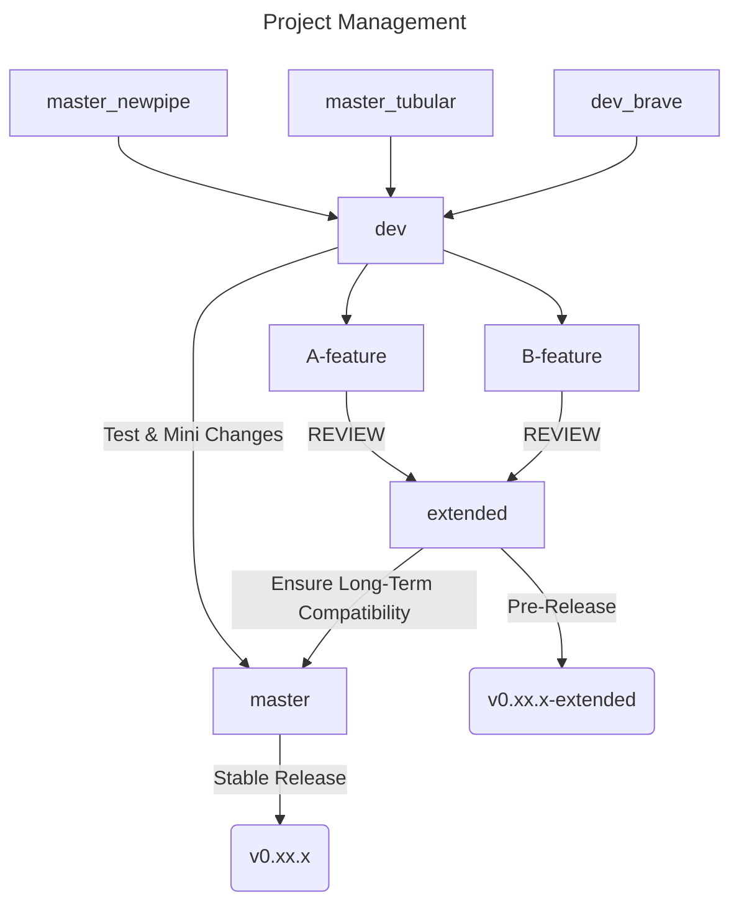
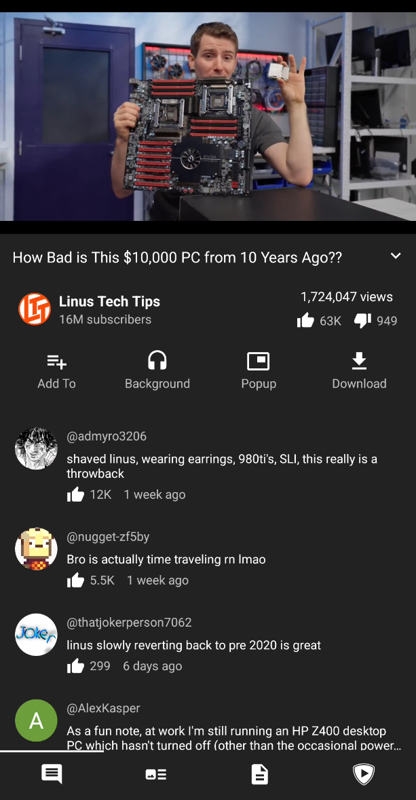
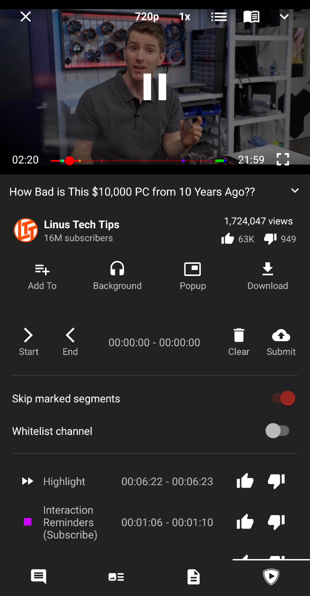
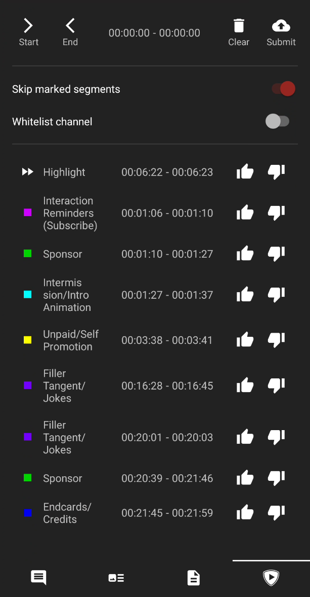
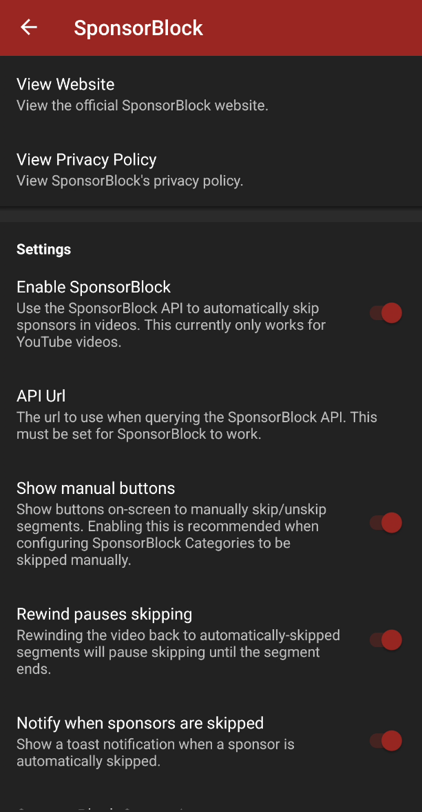

Project Status: #6

<hr>
<p align="center"><a href="https://newpipe.net"></a></p> 
<h2 align="center"><b>LastPipeBender</b></h2>
<h4 align="center">A libre lightweight streaming front-end for Android.</h4>

<!-- <p align="center"><a href="https://f-droid.org/packages/org.schabi.newpipe/"></a></p> -->


<p align="center">
<a href="https://github.com/MaintainTeam/LastPipeBender"></a>
<a href="https://www.gnu.org/licenses/gpl-3.0"></a>
<a href="https://github.com/MaintainTeam/LastPipeBender/actions"></a>
<a href="https://hosted.weblate.org/engage/newpipe/"></a>
<a href="https://web.libera.chat/#newpipe"></a>
<a href="https://matrix.to/#/#newpipe:matrix.newpipe-ev.de"></a>
</p>

### Upstream Projects that Merged
- Completely Merged
  - [NewPipe](https://github.com/TeamNewPipe/NewPipe)
  - [Tubular](https://github.com/polymorphicshade/Tubular)
- Will be Merged
  - [BraveNewPipe](https://github.com/bravenewpipe/NewPipe)
- Other apps to get some other features from
  - [PipePipe](https://github.com/InfinityLoop1308/PipePipe)
  - [SmartTube](https://github.com/yuliskov/SmartTube)
  - [FreeTube](https://github.com/FreeTubeApp/FreeTube/)
  <!-- NEEDS MORE INVESTIGATION
  - Materialious
  - LibreTube
  - Namida
  - PeerTube (new released app by Frama Team)

  --> 

Note: This readme will be updated and more citations will be given


### APK Info

This is the SHA fingerprint of LastPipeBender's signing key to verify downloaded APKs which are signed by us.
```
1B:00:8D:64:BB:95:AB:47:74:D6:8B:87:F2:2B:8B:E9:A2:72:F4:92:4D:F5:20:29:D7:E6:18:38:35:D9:18:CC
```

### Project Management


-to be updated-

## License
[](https://www.gnu.org/licenses/gpl-3.0.en.html)


<!-- <details><summary>Tubular Readme</summary>
<h1 align="center"><b>Tubular</b></h2>
<h4 align="center">A fork of <a href="https://newpipe.net/">NewPipe</a> (<a href="https://github.com/TeamNewPipe/NewPipe/">Github</a>) that implements <a href="https://sponsor.ajay.app/">SponsorBlock</a> (<a href="https://github.com/ajayyy/SponsorBlock/">Github</a>) and <a href="https://www.returnyoutubedislike.com/">ReturnYouTubeDislike</a> (<a href="https://github.com/Anarios/return-youtube-dislike/">Github</a>).</h4>
<p align="center">Download the APK <a href="https://github.com/polymorphicshade/Tubular/releases/latest">here</a>.</p>
<p align="center"></p>

## To Do
Things I'll be working on next (not in any particular order):
- [ ] persist custom SponsorBlock segments in the database
- [ ] add SponsorBlock's "Exclusive Access" / "Sponsored Video feature"
- [ ] add SponsorBlock's chapters feature
- [ ] add a clickbait-remover
- [ ] add keyword/regex filtering
- [ ] add subscription importing with a YouTube login cookie
- [ ] add algorithmic results with a YouTube login cookie
- [ ] add offline YouTube playback

</details>

<details><summary>Newpipe Readme</summary>

<p align="center"><a href="https://newpipe.net"></a></p> 
<h2 align="center"><b>NewPipe</b></h2>
<h4 align="center">A libre lightweight streaming front-end for Android.</h4>

<p align="center"><a href="https://f-droid.org/packages/org.schabi.newpipe/"></a></p>

<p align="center">
<a href="https://github.com/TeamNewPipe/NewPipe/releases" alt="GitHub release"></a>
<a href="https://www.gnu.org/licenses/gpl-3.0" alt="License: GPLv3"></a>
<a href="https://github.com/TeamNewPipe/NewPipe/actions" alt="Build Status"></a>
<a href="https://hosted.weblate.org/engage/newpipe/" alt="Translation Status"></a>
<a href="https://web.libera.chat/#newpipe" alt="IRC channel: #newpipe"></a>
<a href="https://matrix.to/#/#newpipe:matrix.newpipe-ev.de" alt="Matrix channel: #newpipe"></a>
</p>
<hr>
<p align="center"><a href="#screenshots">Screenshots</a> &bull; <a href="#supported-services">Supported Services</a> &bull; <a href="#description">Description</a> &bull; <a href="#features">Features</a> &bull; <a href="#installation-and-updates">Installation and updates</a> &bull; <a href="#contribution">Contribution</a> &bull; <a href="#donate">Donate</a> &bull; <a href="#license">License</a></p>
<p align="center"><a href="https://newpipe.net">Website</a> &bull; <a href="https://newpipe.net/blog/">Blog</a> &bull; <a href="https://newpipe.net/FAQ/">FAQ</a> &bull; <a href="https://newpipe.net/press/">Press</a></p>
<hr>

*Read this document in other languages: [Deutsch](doc/README.de.md), [English](README.md), [Español](doc/README.es.md), [Français](doc/README.fr.md), [हिन्दी](doc/README.hi.md), [Italiano](doc/README.it.md), [한국어](doc/README.ko.md), [Português Brasil](doc/README.pt_BR.md), [Polski](doc/README.pl.md), [ਪੰਜਾਬੀ ](doc/README.pa.md), [日本語](doc/README.ja.md), [Română](doc/README.ro.md), [Soomaali](doc/README.so.md), [Türkçe](doc/README.tr.md), [正體中文](doc/README.zh_TW.md), [অসমীয়া](doc/README.asm.md), [Српски](doc/README.sr.md), [العربية](README.ar.md)* 

> [!warning]
> <b>THIS APP IS IN BETA, SO YOU MAY ENCOUNTER BUGS. IF YOU DO, OPEN AN ISSUE IN OUR GITHUB REPOSITORY BY FILLING OUT THE ISSUE TEMPLATE.</b>
> 
> <b>PUTTING NEWPIPE, OR ANY FORK OF IT, INTO THE GOOGLE PLAY STORE VIOLATES THEIR TERMS AND CONDITIONS.</b>

## Screenshots

[](fastlane/metadata/android/en-US/images/phoneScreenshots/00.png)
[](fastlane/metadata/android/en-US/images/phoneScreenshots/01.png)
[](fastlane/metadata/android/en-US/images/phoneScreenshots/02.png)
[](fastlane/metadata/android/en-US/images/phoneScreenshots/03.png)
[](fastlane/metadata/android/en-US/images/phoneScreenshots/04.png)
[](fastlane/metadata/android/en-US/images/phoneScreenshots/05.png)
[](fastlane/metadata/android/en-US/images/phoneScreenshots/06.png)
[](fastlane/metadata/android/en-US/images/phoneScreenshots/07.png)
[](fastlane/metadata/android/en-US/images/phoneScreenshots/08.png)
<br/><br/>
[](fastlane/metadata/android/en-US/images/tenInchScreenshots/09.png)
[](fastlane/metadata/android/en-US/images/tenInchScreenshots/10.png)

### Supported Services

NewPipe currently supports these services:

<!-- We link to the service websites separately to avoid people accidentally opening a website they didn't want to. -->
<!-- * YouTube ([website](https://www.youtube.com/)) and YouTube Music ([website](https://music.youtube.com/)) ([wiki](https://en.wikipedia.org/wiki/YouTube))
* PeerTube ([website](https://joinpeertube.org/)) and all its instances (open the website to know what that means!) ([wiki](https://en.wikipedia.org/wiki/PeerTube))
* Bandcamp ([website](https://bandcamp.com/)) ([wiki](https://en.wikipedia.org/wiki/Bandcamp))
* SoundCloud ([website](https://soundcloud.com/)) ([wiki](https://en.wikipedia.org/wiki/SoundCloud))
* media.ccc.de ([website](https://media.ccc.de/)) ([wiki](https://en.wikipedia.org/wiki/Chaos_Computer_Club))

As you can see, NewPipe supports multiple video and audio services. Though it started off with YouTube, other people have added more services over the years, making NewPipe more and more versatile!

Partially due to circumstance, and partially due to its popularity, YouTube is the best supported out of these services. If you use or are familiar with any of these other services, please help us improve support for them! We're looking for maintainers for SoundCloud and PeerTube.

If you intend to add a new service, please get in touch with us first! Our [docs](https://teamnewpipe.github.io/documentation/) provide more information on how a new service can be added to the app and to the [NewPipe Extractor](https://github.com/TeamNewPipe/NewPipeExtractor).

## Description

NewPipe works by fetching the required data from the official API (e.g. PeerTube) of the service you're using. If the official API is restricted (e.g. YouTube) for our purposes, or is proprietary, the app parses the website or uses an internal API instead. This means that you don't need an account on any service to use NewPipe.

Also, since they are free and open source software, neither the app nor the Extractor use any proprietary libraries or frameworks, such as Google Play Services. This means you can use NewPipe on devices or custom ROMs that do not have Google apps installed.

### Features

* Watch videos at resolutions up to 4K
* Listen to audio in the background, only loading the audio stream to save data
* Popup mode (floating player, aka Picture-in-Picture)
* Watch live streams
* Show/hide subtitles/closed captions
* Search videos and audios (on YouTube, you can specify the content language as well)
* Enqueue videos (and optionally save them as local playlists)
* Show/hide general information about videos (such as description and tags)
* Show/hide next/related videos
* Show/hide comments
* Search videos, audios, channels, playlists and albums
* Browse videos and audios within a channel
* Subscribe to channels (yes, without logging into any account!)
* Get notifications about new videos from channels you're subscribed to
* Create and edit channel groups (for easier browsing and management)
* Browse video feeds generated from your channel groups
* View and search your watch history
* Search and watch playlists (these are remote playlists, which means they're fetched from the service you're browsing)
* Create and edit local playlists (these are created and saved within the app, and have nothing to do with any service)
* Download videos/audios/subtitles (closed captions)
* Open in Kodi
* Watch/Block age-restricted material

<!-- Hidden span to keep old links compatible. You should remove this span if you're translating the README into another language.-->
<!-- <span id="updates"></span>

## Installation and updates
You can install NewPipe using one of the following methods:
 1. Add our custom repo to F-Droid and install it from there. The instructions are here: https://newpipe.net/FAQ/tutorials/install-add-fdroid-repo/
 2. Download the APK from [GitHub Releases](https://github.com/TeamNewPipe/NewPipe/releases), [compare the signing key](#apk-info) and install it.
 3. Update via F-Droid. This is the slowest method of getting updates, as F-Droid must recognize changes, build the APK itself, sign it, and then push the update to users.
 4. Build a debug APK yourself. This is the fastest way to get new features on your device, but is much more complicated, so we recommend using one of the other methods.
 5. If you're interested in a specific feature or bugfix provided in a Pull Request in this repo, you can also download its APK from within the PR. Read the PR description for instructions. The great thing about PR-specific APKs is that they're installed side-by-side the official app, so you don't have to worry about losing your data or messing anything up.

We recommend method 1 for most users. APKs installed using method 1 or 2 are compatible with each other (meaning that if you installed NewPipe using either method 1 or 2, you can also update NewPipe using the other), but not with those installed using method 3. This is due to the same signing key (ours) being used for 1 and 2, but a different signing key (F-Droid's) being used for 3. Building a debug APK using method 4 excludes a key entirely. Signing keys help ensure that a user isn't tricked into installing a malicious update to an app. When using method 5, each APK is signed with a different random key supplied by GitHub Actions, so you cannot even update it. You will have to backup and restore the app data each time you wish to use a new APK.

In the meanwhile, if you want to switch sources for some reason (e.g. NewPipe's core functionality breaks and F-Droid doesn't have the latest update yet), we recommend following this procedure:
1. Back up your data via Settings > Backup and Restore > Export Database so you keep your history, subscriptions, and playlists
2. Uninstall NewPipe
3. Download the APK from the new source and install it
4. Import the data from step 1 via Settings > Backup and Restore > Import Database

> [!Note]
> When you're importing a database into the official app, always make sure that it is the one you exported _from_ the official app. If you import a database exported from an APK other than the official app, it may break things. Such an action is unsupported, and you should only do so when you're absolutely certain you know what you're doing.

### APK Info

This is the SHA fingerprint of NewPipe's signing key to verify downloaded APKs which are signed by us. The fingerprint is also available on [NewPipe's website](https://newpipe.net#download). This is relevant for method 2.
```
CB:84:06:9B:D6:81:16:BA:FA:E5:EE:4E:E5:B0:8A:56:7A:A6:D8:98:40:4E:7C:B1:2F:9E:75:6D:F5:CF:5C:AB
```

## Contribution
Whether you have ideas, translations, design changes, code cleaning, or even major code changes, help is always welcome. The app gets better and better with each contribution, no matter how big or small! If you'd like to get involved, check our [contribution notes](.github/CONTRIBUTING.md).

<a href="https://hosted.weblate.org/engage/newpipe/">

</a>

## Donate
If you like NewPipe, you're welcome to send a donation. We prefer Liberapay, as it is both open-source and non-profit. For further info on donating to NewPipe, please visit our [website](https://newpipe.net/donate).

<table>
  <tr>
    <td><a href="https://liberapay.com/TeamNewPipe/"></a></td>
    <td><a href="https://liberapay.com/TeamNewPipe/"></a></td>
    <td><a href="https://liberapay.com/TeamNewPipe/donate"></a></td>
  </tr>
</table>

## Privacy Policy

The NewPipe project aims to provide a private, anonymous experience for using web-based media services. Therefore, the app does not collect any data without your consent. NewPipe's privacy policy explains in detail what data is sent and stored when you send a crash report, or leave a comment in our blog. You can find the document [here](https://newpipe.net/legal/privacy/).
</details> -->
