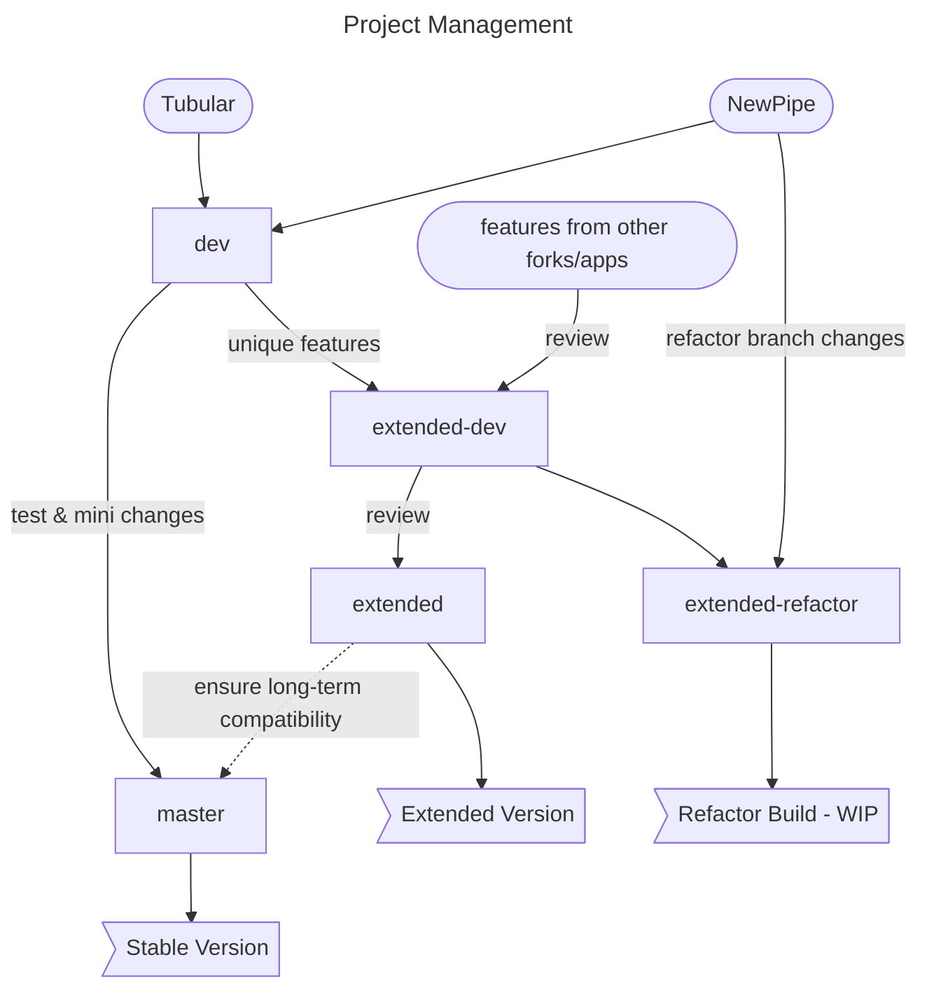

<p align="center"><a href="https://newpipe.net"></a></p> 
<h2 align="center"><b>LastPipeBender</b></h2>
<h4 align="center">A libre lightweight streaming front-end for Android - Fork of NewPipe & Tubular</h4>

<p align="center"><a href="https://maintainteam.github.io/fdroid-pages/fdroid/repo/"></a><br><sup>(F-Droid repo hosted by us, import it to "Repositories")</sup></p><p align="center">


<p align="center">
<a href="https://github.com/MaintainTeam/LastPipeBender"></a>
<a href="https://www.gnu.org/licenses/gpl-3.0"></a>
<a href="https://github.com/MaintainTeam/LastPipeBender/actions"></a>
<!-- <a href="https://hosted.weblate.org/engage/newpipe/"></a> -->
<!--<a href="https://web.libera.chat/#newpipe"></a>-->
<a href="https://matrix.to/#/!tYUpeILeZnyZspckwY:matrix.org?via=matrix.org"></a>
</p>

### General Information
This project has been started for merging Tubular features with latest NewPipe fixes. Later we decided to improve it and created [extended version](https://github.com/MaintainTeam/LastPipeBender/wiki/Extended-Version) to implement new features. While both versions will be the soft-fork (backward-compatible) of NewPipe project, extended version has [new features](https://github.com/MaintainTeam/LastPipeBender/wiki/Extended-Version#list-of-extended-features) and may include some minor bugs. 

We created a Roadmap with mostly feature requests. These features will be added to project after passive maintenance mode ends. See the related [discussion](https://github.com/maintainteam/lastpipebender/discussions/6) for more information about **Roadmap & Project Status** 

### Upstream Projects
- [NewPipe](https://github.com/TeamNewPipe/NewPipe)
  - This is the core of our Project ! 
  - Thanks to TeamNewPipe Maintainers and [Contributors](https://github.com/TeamNewPipe/NewPipe/graphs/contributors)
  - [Donate](https://newpipe.net/donate/)
- [Tubular](https://github.com/polymorphicshade/Tubular)
  - This is the fork that we merged <abbr title="ReturnYouTubeDislike">RYD</abbr> and SponsorBlock features
  - Thanks to @polymorphicshade
- [Other forks/apps to merge other cool features from](https://github.com/MaintainTeam/LastPipeBender/wiki/Alternative-YouTube-Clients-List)


### APK Info & Security

Both Debug and Release versions built by GitHub Actions. You can check checksum notice in Release Actions or/and checksum.txt in releases to compare with Application's

This is the SHA fingerprint of LastPipeBender's signing key to verify downloaded APKs which are signed by us.
```
1B:00:8D:64:BB:95:AB:47:74:D6:8B:87:F2:2B:8B:E9:A2:72:F4:92:4D:F5:20:29:D7:E6:18:38:35:D9:18:CC
```

### Project Management



## License
[](https://www.gnu.org/licenses/gpl-3.0.en.html)
